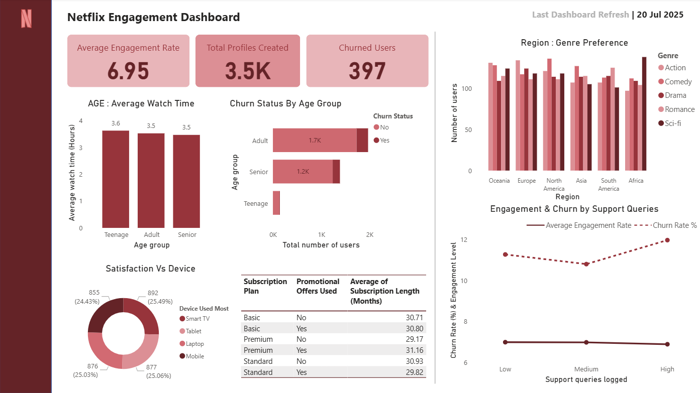

# Netflix Engagement Dashboard

> An interactive Power BI dashboard analyzing Netflix user engagement, churn behavior, subscription patterns, and regional content preferences.

---

## Dashboard Preview



---

## Project Overview

This project analyzes Netflix user behavior across multiple dimensions — age groups, devices, regions, subscription plans, and support query levels. The goal is to surface actionable insights around **user engagement** and **churn reduction** using a single-page executive dashboard.

All data modeling, relationships, and calculations were done entirely within **Power BI Desktop** using **DAX measures** — no external SQL Server or ETL pipeline required.

### Key Business Questions Answered
- What is the overall engagement rate and how many users have churned?
- Which age groups watch the most and which churn the most?
- Does raising support queries correlate with higher churn?
- Which devices are most used and do they affect satisfaction?
- How do promotional offers impact subscription length?
- Which regions prefer which genres?

---

## Dashboard Insights

### KPI Summary
| Metric | Value |
|--------|-------|
| Average Engagement Rate | **6.95** |
| Total Profiles Created | **3,500** |
| Churned Users | **397** |
| Last Refreshed | **20 Jul 2025** |

---

### Age : Average Watch Time
| Age Group | Avg Watch Time (Hours) |
|-----------|----------------------|
| Teenage | 3.6 hrs |
| Adult | 3.5 hrs |
| Senior | 3.5 hrs |

> **Insight:** Watch time is remarkably consistent across all age groups (~3.5 hrs), suggesting Netflix content appeals broadly. Teenagers watch slightly more, which can inform content investment in youth-oriented genres.

---

### Churn Status by Age Group
| Age Group | Total Users |
|-----------|------------|
| Adult | 1,700 |
| Senior | 1,200 |
| Teenage | ~100 |

> **Insight:** Adults represent the largest user base and likely the highest absolute churn count. Teenagers show minimal churn — possibly due to shared family plans. Senior churn warrants attention given their significant presence (1.2K users).

---

### Satisfaction vs Device Used
| Device | Users | Share |
|--------|-------|-------|
| Smart TV | 892 | 25.49% |
| Mobile | 877 | 25.06% |
| Laptop | 876 | 25.03% |
| Tablet | 855 | 24.43% |

> **Insight:** Device usage is almost perfectly balanced across all four platforms — indicating Netflix's cross-device experience is consistent. No single device dominates, so platform-agnostic optimization is the right strategy.

---

### Subscription Plan vs Promotional Offers & Length
| Plan | Promo Used | Avg Subscription Length |
|------|-----------|------------------------|
| Basic | No | 30.71 months |
| Basic | Yes | 30.80 months |
| Premium | No | 29.17 months |
| Premium | Yes | 31.16 months |
| Standard | No | 30.93 months |
| Standard | Yes | 29.82 months |

> **Insight:** Promotional offers have a notable positive effect on **Premium** subscribers (29.17 → 31.16 months, +2 months retention). For Basic and Standard plans, the impact is marginal or slightly negative — suggesting targeted promos should focus on Premium plan users for maximum retention ROI.

---

### Region : Genre Preference
| Region | Top Genres |
|--------|-----------|
| Oceania | Balanced across Action, Comedy, Drama, Romance, Sci-fi |
| Europe | Similar balanced distribution |
| North America | Consistent across all genres |
| Asia | Broadly even, slight Drama lean |
| South America | Broadly even |
| Africa | Highest overall user counts across genres |

> **Insight:** Genre preferences are fairly uniform across all regions, with no single genre dominating in any market. Africa shows the highest user concentration — a potential growth market worth prioritizing for content localization.

---

### Engagement & Churn by Support Queries
| Support Query Level | Avg Engagement Rate | Churn Rate % |
|--------------------|--------------------|--------------| 
| Low | ~7.0 | ~11.0% |
| Medium | ~7.0 | ~10.5% |
| High | ~7.0 | ~12.0% |

> **Insight:** Engagement rate stays flat (~7.0) regardless of support query volume, but **churn rate increases at high support query levels (~12%)** — a strong signal that unresolved support issues directly drive cancellations. Improving support resolution quality, especially for high-query users, should be a priority retention lever.

---

## DAX Measures Used

All calculations were created natively in Power BI using DAX:

```
Average Engagement Rate
Total Profiles Created
Churned Users Count
Churn Rate %
Average Watch Time by Age Group
Average Subscription Length by Plan & Promo
Users by Device
Users by Region & Genre
```

---

## Tools & Technologies

| Tool | Purpose |
|------|---------|
| **Power BI Desktop** | Data modeling, DAX measures, dashboard design |
| **DAX** | All KPI calculations and aggregations |
| **Power Query (M)** | Data cleaning and transformation |
| **GitHub** | Version control and portfolio showcase |

---

## Author

**Erika Shrestha**
- Email: erikashrestha333@gmail.com
- LinkedIn: https://www.linkedin.com/in/erika-shrestha/
- GitHub: https://github.com/Erika-Shrestha/

---
